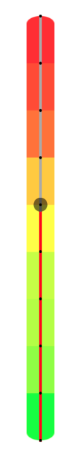

---
react-native-featured-slider
---

Sliders allow users to select a value from a extended set of options.



> This component is a forked implementation of
> [react-native-elements](https://github.com/react-native-elements).

## Usage

```js
import { Slider } from 'react-native-featured-slider';

<View style={{ flex: 1, alignItems: 'stretch', justifyContent: 'center' }}>
  <Slider
    value={this.state.value}
    onValueChange={(value) => this.setState({ value })}
  />
  <Text>Value: {this.state.value}</Text>
</View>;
```

---

## Props

- [Usage](#usage)
- [Props](#props)
- [Reference](#reference)
  - [`animateTransitions`](#animatetransitions)
  - [`animationConfig`](#animationconfig)
  - [`animationType`](#animationtype)
  - [`debugTouchArea`](#debugtoucharea)
  - [`disabled`](#disabled)
  - [`maximumTrackTintColor`](#maximumtracktintcolor)
  - [`maximumValue`](#maximumvalue)
  - [`minimumTrackTintColor`](#minimumtracktintcolor)
  - [`minimumValue`](#minimumvalue)
  - [`onSlidingComplete`](#onslidingcomplete)
  - [`onSlidingStart`](#onslidingstart)
  - [`onValueChange`](#onvaluechange)
  - [`orientation`](#orientation)
  - [`step`](#step)
  - [`style`](#style)
  - [`thumbStyle`](#thumbstyle)
  - [`thumbTintColor`](#thumbtintcolor)
  - [`thumbTouchSize`](#thumbtouchsize)
  - [`trackStyle`](#trackstyle)
  - [`value`](#value)
  - [`tickMarks`](#tickmarks)
  - [`tickMarksColor`](#tickmarkscolor)
  - [`backgroundImage`](#backgroundimage)
  - [`backgroundColor`](#backgroundcolor)
  - [`revert`](#revert)
  - [`updateOnPress`](#updateonpress)

---

## Reference

### `animateTransitions`

Set to true if you want to use the default 'spring' animation

| Type | Default | Optional |
| :--: | :-----: | :------: |
| bool |  false  |   Yes    |

---

### `animationConfig`

Used to configure the animation parameters. These are the same parameters in the
[Animated library](https://facebook.github.io/react-native/docs/animations.html).

|  Type  |  Default  | Optional |
| :----: | :-------: | :------: |
| object | undefined |   Yes    |

---

### `animationType`

Set to 'spring' or 'timing' to use one of those two types of animations with the
default
[animation properties](https://facebook.github.io/react-native/docs/animations.html).

|  Type  | Default  | Optional |
| :----: | :------: | :------: |
| string | 'timing' |   Yes    |

---

### `debugTouchArea`

Set this to true to visually see the thumb touch rect in green.

| Type | Default | Optional |
| :--: | :-----: | :------: |
| bool |  false  |   Yes    |

---

### `disabled`

If true the user won't be able to move the slider

| Type | Default | Optional |
| :--: | :-----: | :------: |
| bool |  false  |   Yes    |

---

### `maximumTrackTintColor`

The color used for the track to the right of the button

|  Type  |  Default  | Optional |
| :----: | :-------: | :------: |
| string | '#b3b3b3' |   Yes    |

---

### `maximumValue`

Initial maximum value of the slider

|  Type  | Default | Optional |
| :----: | :-----: | :------: |
| number |    1    |   Yes    |

---

### `minimumTrackTintColor`

The color used for the track to the left of the button

|  Type  |  Default  | Optional |
| :----: | :-------: | :------: |
| string | '#3f3f3f' |   Yes    |

---

### `minimumValue`

Initial minimum value of the slider

|  Type  | Default | Optional |
| :----: | :-----: | :------: |
| number |    0    |   Yes    |

---

### `onSlidingComplete`

Callback called when the user finishes changing the value (e.g. when the slider
is released)

|   Type   | Default | Optional |
| :------: | :-----: | :------: |
| function |         |   Yes    |

---

### `onSlidingStart`

Callback called when the user starts changing the value (e.g. when the slider is
pressed)

|   Type   | Default | Optional |
| :------: | :-----: | :------: |
| function |         |   Yes    |

---

### `onValueChange`

Callback continuously called while the user is dragging the slider

|   Type   | Default | Optional |
| :------: | :-----: | :------: |
| function |         |   Yes    |

---

### `orientation`

Set the orientation of the slider.

|  Type  |   Default    | Optional |
| :----: | :----------: | :------: |
| string | 'horizontal' |   Yes    |

---

### `step`

Step value of the slider. The value should be between 0 and maximumValue -
minimumValue)

|  Type  | Default | Optional |
| :----: | :-----: | :------: |
| number |    0    |   Yes    |

---

### `style`

The style applied to the slider container

|                                 Type                                 | Default | Optional |
| :------------------------------------------------------------------: | :-----: | :------: |
| [style](http://facebook.github.io/react-native/docs/view.html#style) |         |   Yes    |

---

### `thumbStyle`

The style applied to the thumb

|                                 Type                                 | Default | Optional |
| :------------------------------------------------------------------: | :-----: | :------: |
| [style](http://facebook.github.io/react-native/docs/view.html#style) |         |   Yes    |

---

### `thumbTintColor`

The color used for the thumb

|  Type  |  Default  | Optional |
| :----: | :-------: | :------: |
| string | '#343434' |   Yes    |

---

### `thumbTouchSize`

The size of the touch area that allows moving the thumb. The touch area has the
same center as the visible thumb. This allows to have a visually small thumb
while still allowing the user to move it easily.

|  Type  |          Default          | Optional |
| :----: | :-----------------------: | :------: |
| object | `{width: 40, height: 40}` |   Yes    |

---

### `trackStyle`

The style applied to the track

|                                 Type                                 | Default | Optional |
| :------------------------------------------------------------------: | :-----: | :------: |
| [style](http://facebook.github.io/react-native/docs/view.html#style) |         |   Yes    |

---

### `value`

Initial value of the slider

|  Type  | Default | Optional |
| :----: | :-----: | :------: |
| number |    0    |   Yes    |

---

### `tickMarks`

Display tick marks

|  Type  | Default | Optional |
| :----: | :-----: | :------: |
|  bool  |  false  |   Yes    |

---

### `tickMarksColor`

The color of the tick marks

|  Type    | Default | Optional |
| :------: | :-------: | :------: |
|  string  | '#000'    |   Yes    |

---

### `backgroundImage`

The background image

|  Type  | Default | Optional |
| :---: | :-----: | :------: |
|  any  |  null   |   Yes    |

---

### `backgroundColor`

The background color of the slider (useful if you are working with a background image)

|  Type    | Default | Optional |
| :------: | :-------: | :------: |
|  string  |  '#fff'   |   Yes    |

---

### `revert`

To revert the slider. Reverts the min/max values

|  Type  | Default | Optional |
| :----: | :-----: | :------: |
|  bool  |  false  |   Yes    |

---

### `updateOnPress`

To update the value if a position on the slider is pressed

|  Type  | Default | Optional |
| :----: | :-----: | :------: |
|  bool  |  false  |   Yes    |